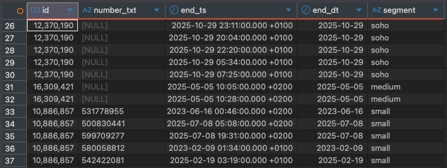

# Zadanie rekrutacyjne - SQL (Mateusz Wykowski)

## Cel projektu
Celem projektu było przygotowanie czystych i spójnych danych oraz realizacja zadań rekrutacyjnych na dwóch tabelach ('test_baza1', 'test_baza2')
W projekcie pokazano cały proces począwszy od analizy i czyszczeniu, aż po tworzenie warstwy staging i rozwiązaniu czterech zadań.

---

## Struktura repozytorium

```
zadanie_rekrutacyjne/
│
├── Data/                      # Dane wejściowe
│   ├── TEST_BAZA1.csv
│   └── TEST_BAZA2.csv
│
├── SQL/                       # Zapytania SQL + komentarze
│   └── Zapytania_sql.sql
│
├── html/                      # Wyniki zapisane do HTML
│   └── tab.html
│
├── images/                    # Zrzuty ekranu z wyników
│   ├── typy_kolumn_tb1.png
│   ├── typy_kolumn_tb2.png
│   ├── eksploracja_tb1.png
│   ├── eksploracja_tb2.png
│   ├── stg_test_baza1.png
│   ├── stg_test_baza2.png
│   ├── table_temp.png
│   ├── zadanie_2.png
│   ├── zadanie_3.png
│   ├── zadanie_4.png
│   └── tabela_prio.png
│
├── zadania/                   # Pliki pomocnicze
│   ├── TAB.xlsx
│   └── zadania.txt
│
└── README.md                  # Dokumentacja projektu
```

---

## Etap analizy

W tym etapie sprawdzono strukturę oraz typy danych w tabelach źródłowych, 
aby zidentyfikować potencjalne niespójności (np. różne typy kolumn o tej samej nazwie).  
Na tej podstawie zaplanowano późniejsze ujednolicenie danych w warstwie **staging**.

**SQL:**
```sql
SELECT 
    column_name,
    data_type
FROM information_schema.columns
WHERE table_name ='test_baza1'
ORDER BY ordinal_position;
```


**SQL:**
```sql
SELECT 
    column_name,
    data_type
FROM information_schema.columns
WHERE table_name ='test_baza2'
ORDER BY ordinal_position;
```


**SQL:**
```sql
select *
from public.test_baza1 tb1
WHERE NULLIF(TRIM("NUMBER"), '') IS NOT NULL
limit 10;
```


**SQL:**
```sql
select *
from public.test_baza2 tb2
limit 10;
```


**Komentarz:**
Zidentyfikowane różnice typów między tabelami ('varchcar', 'int'), co wymaga ujednolicenia w warstwie staging

---

## Tworzenie warstwy staging

W warstwie staging ujednolicono typy i formaty danych z tabel źródłowych, 
oczyszczając kolumny z błędnych wartości i różnic w nazwach. 
Dzięki temu dalsze zapytania mogły działać na spójnych, standaryzowanych danych.

**SQL:**
```sql
create or replace view public.stg_test_baza1 as 
	select
		"ID"::bigint										as id,			
		nullif(regexp_replace("NUMBER", '\D', '', 'g'), '') as number_txt,	--czyszczenie numeru z niepotrzebnych znaków 
		to_timestamp("END_DT", 'DD.MM.YYYY HH24::MI') 		as end_ts,		--konwertuje tekst z datą na timestamp
		DATE(to_timestamp("END_DT", 'DD.MM.YYYY HH24::MI')) as end_dt,		--rzutuje dane w formcaie 'DD-MM-YYYY HH:MI'
		lower(trim("SEGMENT"))								as segment
	from public.test_baza1;
```




**SQL:**
```sql
create or replace view public.stg_test_baza2 as
	select
		"ID"::bigint												as id,
		nullif(regexp_replace("NUMBER"::text, '\D', '', 'g'), '')  	as number_txt,
		upper(trim("PLAN")) 										as plan	--Standaryzuje plan -> S, M, L, X
	from public.test_baza2;
```


**Komentarz:**
Dane zostały oczyszczone, przekształcone i przygotowane do dalszych analiz. Został stworzony nowy widok, aby zachować spójność danych i łatwość analiz.

---

## Zadanie 1

**Cel:** Wybór aktywnych usług w segmentach small i soho.
**Wynik:** tabela tmp.

**SQL:**
```sql
create table public.temp AS
select
	stb1.number_txt,
	stb1.end_dt,
	stb1.segment,
	coalesce(
		stb2.plan,
		case
			when stb1.segment = 'soho' then 'S'
			when stb1.segment = 'small' then 'M'
		END 
	) as plan
from public.stg_test_baza1 stb1
left join public.stg_test_baza2 stb2
	using (id)
where
	stb1.end_dt > CURRENT_DATE
	and stb1.end_dt < CURRENT_DATE + interval '90 day'
	and stb1.segment IN ('small', 'soho');
```


---

## Zadanie 2

**Cel:** Podsumowanie liczby rekomendacji per plan (S, M, L, X) w odpowiedniej kolejności.

**SQL:**
```sql
with clean_plan as(
	select
		COALESCE(NULLIF(plan, ''), 'brak informacji') AS plan,
		number_txt
	from public.temp
)
select 
	plan,
	COUNT(number_txt) as ilosc_rekomendacji
from clean_plan
group by
plan
order by 
	case
		plan 
		when 'S' then 1
		when 'M' then 2
		when 'L' then 3
		when 'X' then 4
		else 0
	end;
```


---

## Zadanie 3

**Cel:** Określenie najczęściej występującej rekomendacji per ID, z priorytetem S < M < L < X

**SQL:**
```sql
with most_frequent as (
	select
		id,
		plan,
		COUNT(*) as cnt,
		case plan
			when 'S' then 1
			when 'M' then 2
			when 'L' then 3
			when 'X' then 4
			else 0
		end as plan_rank
	from public.stg_test_baza2
	where 
		plan is not null and TRIM(plan) <> ''		--Nie biorę NULL/'' do rankingu
	group by 
	1, 2
),
--Dla każdego ID wybieram plan o największej liczbie wystapien
final_pick as(
		select 
		id,
		plan,
		cnt,
		row_number() over(
		partition by ID
		order by cnt desc, plan_rank desc --wybiera wyższą rekomendację, jeżeli dopasowana są tej samej liczność
		) as ranking
	from most_frequent
)
--Pokazuje koncowy wynik 
select 
id,
plan as rekomendacja
from final_pick
where ranking=1
order by id;
```


---

## Zadanie 4

**Cel:** agregacja numerów per ID w formacie:
S: 5120000217, 546508046 | m: 577290614, 58172979 | X: 553705789

**SQL:**
```sql
WITH agg AS (
  SELECT
    id,
    STRING_AGG(number_txt::text, ', ' ORDER BY number_txt)
      FILTER (WHERE plan = 'S' AND number_txt IS NOT NULL) AS s_nums,
    STRING_AGG(number_txt::text, ', ' ORDER BY number_txt)
      FILTER (WHERE plan = 'M' AND number_txt IS NOT NULL) AS m_nums,
    STRING_AGG(number_txt::text, ', ' ORDER BY number_txt)
      FILTER (WHERE plan = 'L' AND number_txt IS NOT NULL) AS l_nums,
    STRING_AGG(number_txt::text, ', ' ORDER BY number_txt)
      FILTER (WHERE plan = 'X' AND number_txt IS NOT NULL) AS x_nums
  FROM public.stg_test_baza2
  GROUP BY id
)
--Łączę listy numerów z poszczególnych plnanów w jeden tekst,
--Funkcją ARRAY_REMOVE usuwa puste elementy, natomiast funkcja ARRAY_TO_STRING skleja je w czytelny format
SELECT
  id,
  ARRAY_TO_STRING(
    ARRAY_REMOVE(ARRAY[
      CASE WHEN s_nums IS NOT NULL THEN FORMAT('S: %s', s_nums) END,
      CASE WHEN m_nums IS NOT NULL THEN FORMAT('M: %s', m_nums) END,
      CASE WHEN l_nums IS NOT NULL THEN FORMAT('L: %s', l_nums) END,
      CASE WHEN x_nums IS NOT NULL THEN FORMAT('X: %s', x_nums) END
    ], NULL),
    ', '
  ) AS lista
FROM agg
ORDER BY id;
```


---

## Zadanie 5 - stworzenie pliku html

**Cel:** Stworzenie takiego samego widoku tabeli xlsx, w pliku html.


---

## Autor
```
Mateusz Wykowski
17.10.2025
https://github.com/Wykoo/zadanie_rekrutacyjne
```


